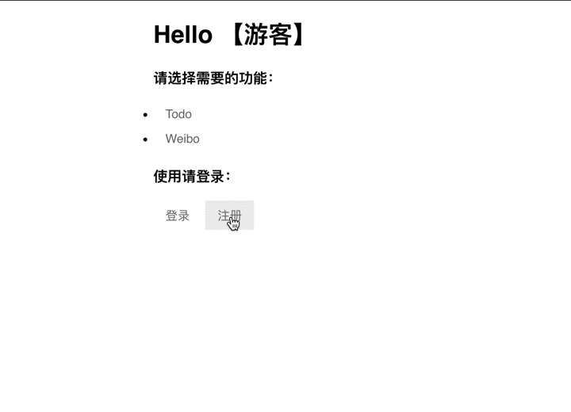

## Socket MVC Web Server
----------------
- 这是一个纯python写的MVC模式的web框架，具备模型、路由、视图等模块。模型层编写了BaseModel，包含基础的类属性、结合ORM实现的CURD操作，通过继承可快速构建数据模型。路由层接收控制层传来的请求分发到对应的视图函数中。视图层根据分发的请求作出响应渲染页面发送给客户端。框架也支持JSON数据发送，后端提供API接口，根据前端请求返回对应的JSON数据。演示就是使用前后端分离模式开发的。

### 演示小程序
---------------
#### Todo 和 Weibo

